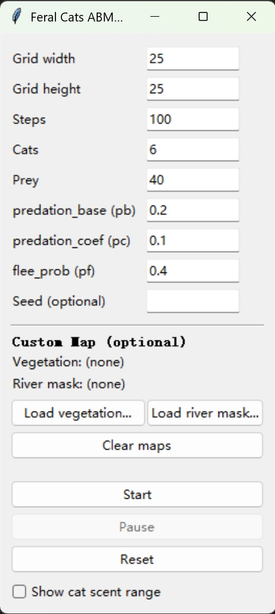
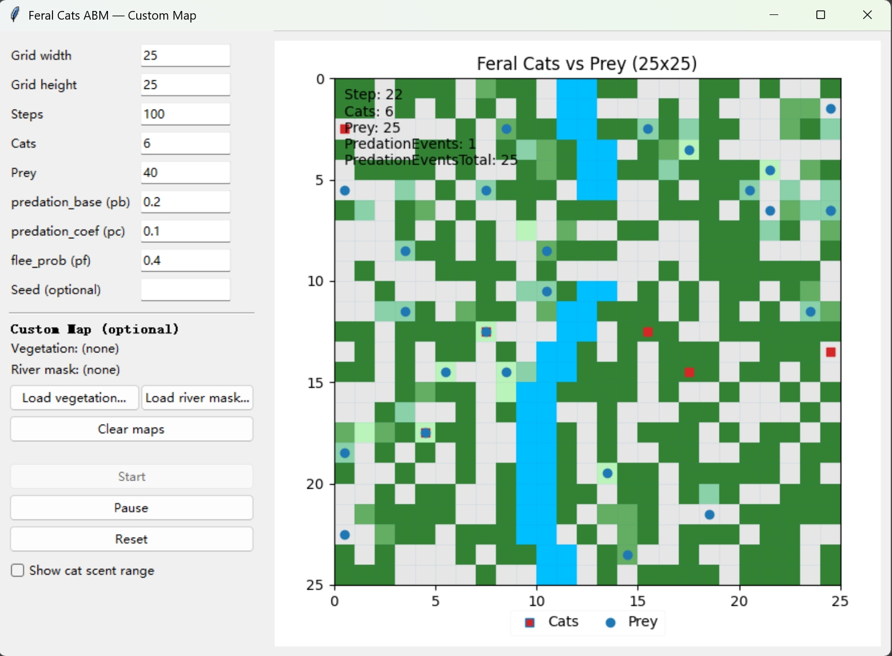
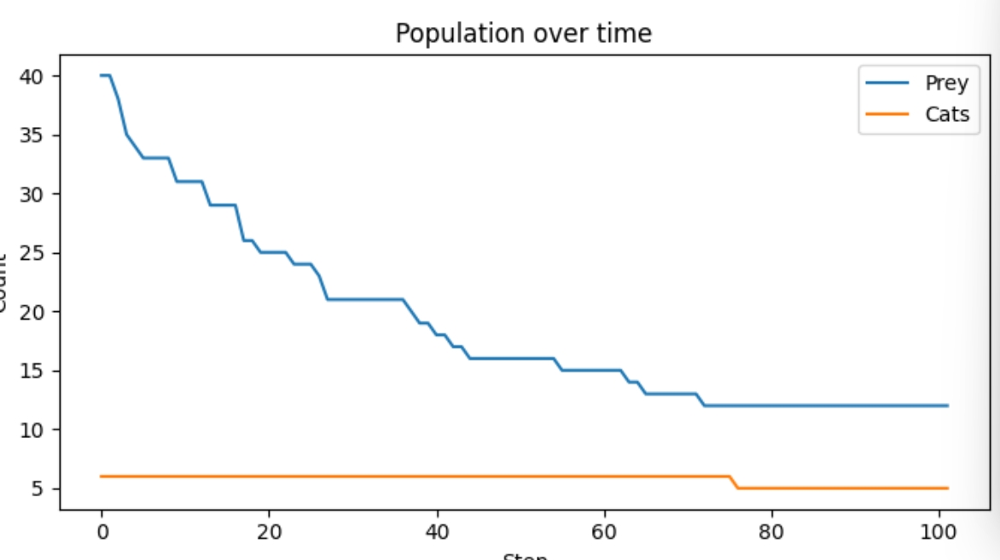
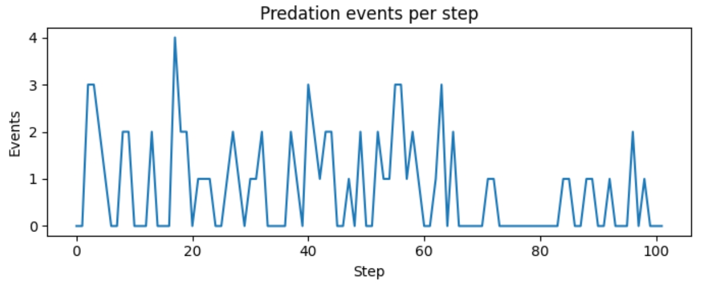

# FeralCats Inc.

<p align="center">
  <b>Feral Cats and Small Mammals: Modeling Predation Risk Shaped by Scent Mark Diffusion</b>
</p>

<p align="center">
  <i>Agent-Based Framework • Trend plots • Evolving visulization • Valuable insights</i>
</p>

## ⚡ Quick Start

### Prerequisites

- Python 3.10+
- pip
- Git

### Setup & Installation

1. **Clone the repository**

```bash
git clone https://github.com/Oliverkkkk/CITS4403.git
cd CITS4403
```

2. **Create and activate a virtual environment**

```bash
# For Windows
python -m venv venv
venv\Scripts\activate

# For Windows PowerShell
python -m venv venv
.\venv\Scripts\Activate

# For macOS/Linux
python -m venv venv
source venv/bin/activate
```

3. **Install dependencies**

```bash
pip install -r requirements.txt
```

4. **Run the application**

Interactive GUI entry:
```bash
# Run from project root
python run.py
```

## 📚 Dashboard & Outputs

This project implements an agent-based model (ABM) of **feral cats vs prey** in a spatial grid environment.  
The interactive dashboard allows users to configure parameters, run simulations, and visualize outcomes.

1. **Simulation Dashboard**
  
The control panel lets users specify grid size, number of steps, initial cat/prey populations, and model parameters (e.g., predation rates, flee probability).  
Users can also load custom vegetation/river maps and toggle the display of cat scent ranges.

2. **Grid Animation**
[](./data/materials/2DAnime.mp4)
During simulation, the grid shows cats (red squares), prey (blue circles), vegetation (green), and rivers (blue, can not pass).  
Predation events are tracked dynamically, giving a clear picture of spatial interactions.

3. **Population Over Time**
  
This plot shows the changes in prey and cat populations across simulation steps.  
It highlights population decline due to predation and ecological constraints.

4. **Predation Events per Step**
  
This plot records the number of predation events at each time step, reflecting hunting dynamics and prey vulnerability throughout the simulation.

## 📂 Project Structure

```
Feral_Cats_and_Small_Mammals/
│
├── data/ # Data files and initialization scripts
│ └── maps/ # Store generated maps
│ └── data_init.py # Data preparation and map initialization
│
├── notebooks/ # Jupyter notebooks for analysis & experiments
│ ├── group_notebook.ipynb
│ └── notebook_init.py
│
├── src/ # Core source code of the simulation
│ ├── agents.py # Agent definitions (e.g., cats, prey)
│ ├── model.py # Main model logic
│ ├── visual2d.py # 2D visualization of the grid/world
│ └── init.py
│
├── utils/ # Helper and runner scripts
│ ├── run_mini.py # Minimal run configuration
│ ├── run_random.py # Randomized run configuration
│ └── utils_init.py
│
├── run.py # Entry point to run the interactive simulation
├── requirements.txt # Python dependencies
├── .gitignore # Git ignore rules
└── README.md # Project documentation
```

## 👥 Team

Feral_Cats_and_Small_Mammals was created by:

- **Jiajin Kong**
- **Jonas Liu**